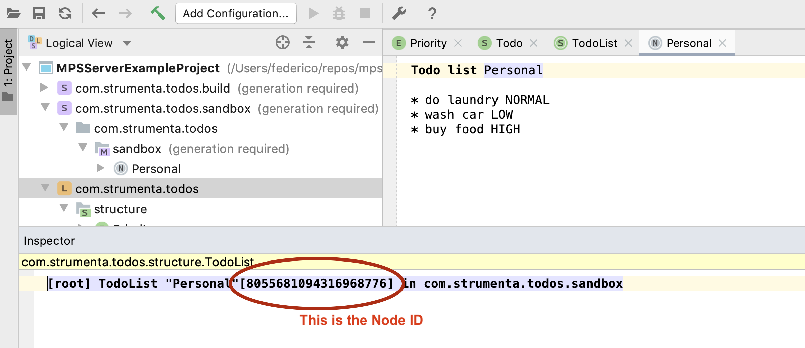
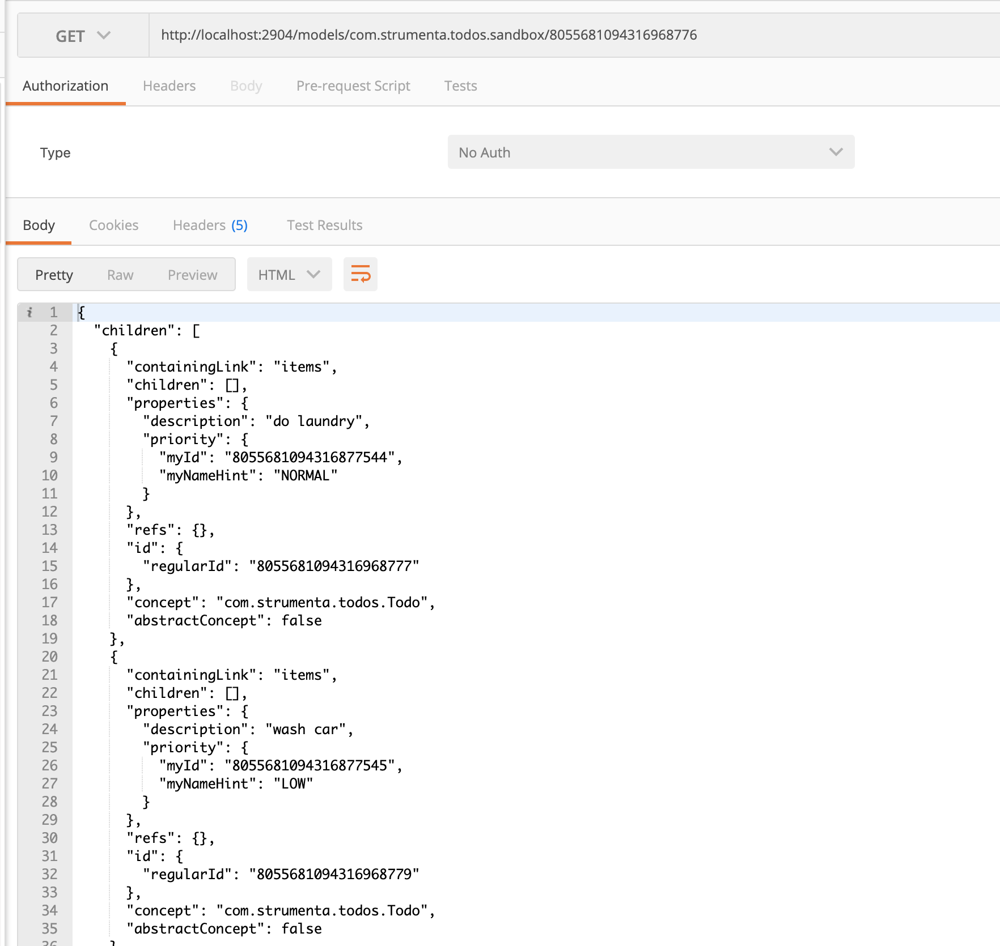

# MPSServer

[](https://actions-badge.atrox.dev/Strumenta/MPSServer/goto)
[  ](https://bintray.com/strumenta/strumenta-oss-maven/MPSServer/_latestVersion)


This is a solution that starts a server to read and modify MPS models through HTTP and WebSocket.

The server can be started from MPS running normally or in headless mode.

There is also a framework to define web editors interoperable with MPSServer. This framework is called [WebEditKit](https://github.com/Strumenta/webeditkit) and it is open-source.

You can find some basic instructions and an example here: https://github.com/Strumenta/calc-webeditkit-example

## License

MPSServer is released under the Apache License V2

## The simplest way to use MPSServer

Simply look in the `example` directory.

Basically you need a simple build.gradle file in your project and that is it.

1. Create this build.gradle file

```
buildscript {
    repositories {
        jcenter()
        maven { url 'https://projects.itemis.de/nexus/content/repositories/mbeddr' }
    }
}

plugins {
    id 'com.strumenta.mpsserver' version "0.1.0"
}

repositories {
	mavenCentral()
	maven {
		url 'https://dl.bintray.com/strumenta/strumenta-oss-maven'
	}
	maven {
		url 'https://projects.itemis.de/nexus/content/groups/OS/'
	}
}

mpsserver {
	mpsServerVersion = '1.1.0-rc1'
}
```

2. Launch `./gradlew launchMpsServer`

And you are good to go!

At that point simply visit `http://localhost:2904/models/<my model>/<my node id>` to see the data of your model.

You can find the Node ID in the inspector:


And this is how you can use the simplest API call:


## How to configure MPSServer Launcher

MPSServer comes with a launcher: you can see it as a command line application that embeds an instance of MPS headless.

The launcher can be run:

* As a contributor to MPSServer: using this source and running `./gradlew runLauncher`
* As a user of MPSServer: using the [MPSServer Gradle Plugin](https://github.com/Strumenta/mpsserver-gradle-plugin)

This launcher can be configured. Read instructions here: [configuration](documentation/configuration.md)

## Exposed API

It is possible to use the MPSServer through:

* HTTP calls, [documented here](documentation/routes.md)
* WebSocket messages, [documented here](documentation/wsprotocol.md)

## Extensions

It is possible to specify extensions for the MPS Server.

TODO: document how to do that.

## Development

### Testing

The project contains:

* unit tests: written within MPS
* functional tests: written in Python

To run the unit tests inside MPS, first you have to set the path
variable "mpsserver.home" (MPS > Preferences > Appearance & Behavior >
Path Variables) to the full path to the directory MPSServer/mpscode.
Then, you can launch them from the MPS UI (right click > run).

### Release a new version

* Check all tests pass on the CI server (currently using GitHub actions)
* Set the version number in build.gradle
* Add a tag: `git tag -a vVERSION_NAME` (message: "Version VERSION_NAME")
* Ensure the tag is pushed
* Run `./gradlew publish`
* Log into `https://oss.sonatype.org/` to close & release

